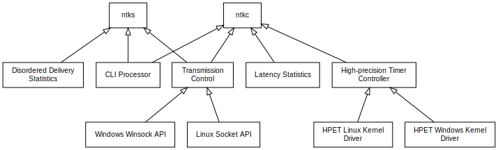
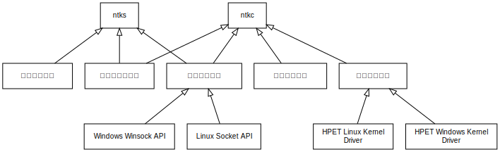

# ntweak - A debugger for custom network protocol bellow transport layer

## Requirements

1. Support random or customized traffic (tcp/udp) to a designated network address.
2. Support transmission at constant time interval with precision up to millisecond.
3. Support single packet transmission
4. Support statistics of retransmission & disordered-transmission
5. Support the following statistics
   * latency (min,max,avg,distribution)
   * average data rate of transmission
   * data loss rate
6. Support Windows/Linux

## Component



## CLI argument

```
ntkc -i interval(ms) -s packet size(byte) -n total number -r server ip/port
```

```
ntks -t tcp port -u udp port
```

## Procedure


1. establish session
2. response
3. send a packet
4. record disordered delivery
5. send back
6. calc round-trip delay
7. request transmission report
8. send transmission report
9. close session

## Issues

1. Use CPU built-in high-precision timer for interrupt
2. Calculate latency properly


# ntweak - 适用于传输层以下自定义网络的调试助手 

## 功能需求

1. 支持向指定网络地址发送自定义或随机网络数据，支持TCP/UDP协议
2. 支持控制单个数据包发送时间间隔,时间精确到毫秒级
3. 支持发送单个数据包
4. 支持重传与乱序检测与统计
5. 支持传输质量统计功能
   * 传输时延(最大,最小,平均,分布)
   * 平均传输速率
   * 丢包率
6. 支持Windows和Linux系统


## 系统组成



## 命令行参数

```
ntkc -i 发包间隔(毫秒) -s 单包长度(字节) -n 发包总数 -r 服务器ip/端口号
```

```
ntks -t tcp端口号 -u udp端口号
```

## 工作流程


1. 客户端发起建立测试连接
2. 服务端响应
3. 客户端开始按指定间隔发送数据包
4. 乱序数据包统计
5. 回发数据包
6. 统计延时
7. 请求传输质量报告
8. 发送传输质量报告
9. 关闭测试连接

## 疑难问题

1. 使用CPU内部硬件timer进行精密定时
2. 正确统计传输时延


